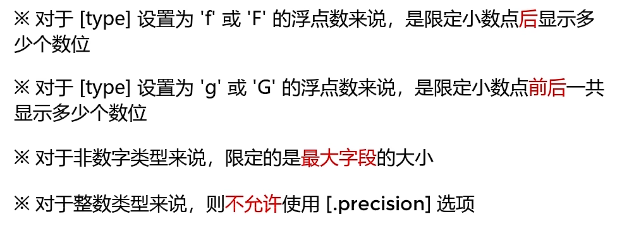
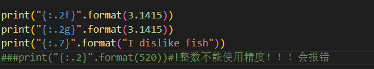
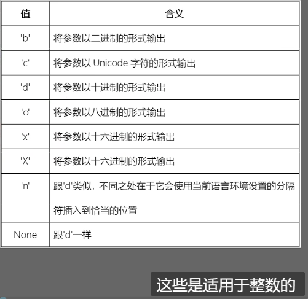
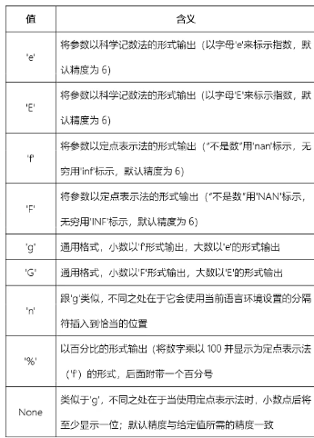

# 规范化函数参数

.assets/image-20230220224850612-1676904534422-1.png>)

## [align]

- 在{}内加入加入相应值，例如{:>}

.assets/image-20230218231219328-1676733147594-1.png>)

## [width]

在括号内用来指定字符串宽度
print("{:^10}".format(250)) #其中的 10 就是指定的宽度。而^是指居中对齐


- 符号选项 仅对数字类型有效
  ``
- 精度选项

  



- 类型选项
- 



- .assets/image-20230220230647023-1676905608358-15.png>)

“#” 会自动追加前缀



## p 36 序列(下)

/1677381400216.png>)

/1677381749283.png>)

/1677382698259.png>)

/1677383332103.png>)

一个迭代器肯定是一个可迭代对象

但是：可迭代对象可以重复使用，迭代器是一次性的。

p37 字典的关键符号是 {} ： 映射的元素都用大括号框起来然后前面是键(密文)冒号后面是值（明文）

### p38 创建字典的几种方法 ： 第一种是直接使用大括号和冒号 ↑

```python
a = {"吕布":"口口布","关羽":"关习习","刘备":"刘Baby"}
```

第二种是用 dict 函数

```python
b = dict(吕布="口口布",关羽="关习习",刘备="刘Baby")
```

第三种方法是使用列表作为参数

```python
c = dict([("吕布","口口布"),("关羽","关习习"),("刘备","刘Baby")])
```

第四种方法是属于无病呻吟的方法只有酱第一种方法作为参数传递给这个 dict 这个函数

```python
d = dict({"吕布":"口口布","关羽":"关习习","刘备":"刘Baby"})
```

第五种方法是属于混合拳方法

```python
e = dict({"吕布":"口口布","关羽":"关习习"},刘备="刘Baby"})
```

第六种方法 是利用 zip()函数

```python
 f = dict(zip(["吕布","关羽","刘备"],["口口布","关习习","刘Baby"]))
```

### 字典的增删改查

/1678288127077.png>)

使用 iterable 指定的可迭代对象来创建一个新的字典，并将所有的值初始化为 values 参数指定的值

#### 删除字典中指定的元素

/1678288547617.png>)
删除没有的键会出错，可以添加 default 参数避免，例如写没有，删除不存在的键就会返回没有。

**del**可以直接删除指定的键或者字典

#### 改

/1678289416244.png>)
支持传入多个键值进行修改

#### 查

/1678289673146.png>)

查找输入的键，没有则返回默认值

/1678459801421.png>)

分别获取键值对、键、值三者的视图对象
