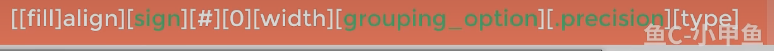

# 规范化函数参数

.assets/image-20230220224850612-1676904534422-1.png)

## [align]

+ 在{}内加入加入相应值，例如{:>}

.assets/image-20230218231219328-1676733147594-1.png)

## [width]

在括号内用来指定字符串宽度
print("{:^10}".format(250)) #其中的10就是指定的宽度。而^是指居中对齐

+ 符号选项 仅对数字类型有效
  ``
+ 精度选项

  

+ 类型选项
+ 

+ .assets/image-20230220230647023-1676905608358-15.png)

“#”  会自动追加前缀

